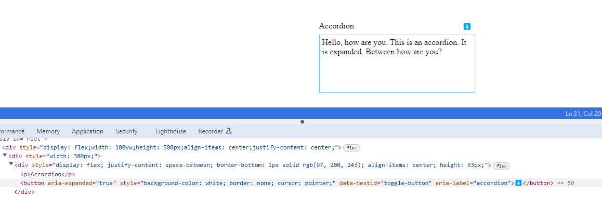

This article dives into a comparison between mainstream UI component libraries and a new design pattern which helps in crafting light weighted yet effective components.

Imagine this, You're working on a new project and you need a sleek and interactive accordion component to display content in a collapsible manner. Fortunately, `Material-UI` offers the perfect solution with its `Accordion` component. With just a few lines of code, you can smoothly bring to life a functional accordion component.

But if you want to tailor it to fit seamlessly into your product's unique design language, it can be done using one of the two options:

1. `CSS overrides`
2. `Theme-specific props`

Below is the code for the same:

```ts
/* styles.css */ // you can do this 👇
.MuiAccordion-root {
  background-color: #f7f7f7;
  border: 1px solid #e0e0e0;
}

.MuiAccordionSummary-root {
  background-color: #f0f0f0;
}

.MuiAccordionDetails-root {
  padding: 16px;
}

 //or  you can do this 👇
 import { createTheme, ThemeProvider } from '@mui/material/styles';
 const theme = createTheme({
  palette: {
    primary: {
      main: '#3f51b5',
    },
    secondary: {
      main: '#f50057',
    },
  },
  // Add more customizations as needed
});

function App() {
  return (
    <ThemeProvider theme={theme}>
      {/* Your application components */}
    </ThemeProvider>
  );
}
 <Accordion
  sx={{
    backgroundColor: theme.palette.background.paper,
    border: `1px solid ${theme.palette.divider}`,
  }}
>
  {/* Accordion content */}
</Accordion>
```

That’s great. Right now, we have a decent understanding about how an Accordion can be tuned.

> But product team being product team, they won’t be happy! They want to launch rockets through the accordion component!

After a few days, they may come with a new requirement for functionalities around the component. To achieve these functionalities, we may require more APIs from Material UI, which does not currently support the Accordion component.

So we're stuck looking for another Component Library that fits our needs. After exploring and experimenting, we may be able to produce something that fits the criteria. It may look like something below:


While it looks like a not-so-pleasant hybrid of a lot of things, it serves our needs!

Component Libraries are great, no doubt about that! I myself use Material UI to get jobs done many a times.
But component libraries that bundle functionalities and pre-designed UI components together can have their pitfalls, like the following:

- Do not have the freedom to build the exact UI you want, rather than being limited to the pre-designed components provided by a component library.
- Limited customization.
- Limited control over the component.
- Increases bundle Size as they are overloaded with styles and functionality we do not want.

To overcome these, let's create an Accordion as per our needs. This will not require any other design system libraries.
Firstly, we do not want styling files as part of the component library. Our sole aim is to create accessible components without their pre-set styling.


## Accordion : Design

To overcome these, let's create an Accordion as per our needs. This will not require any other design system libraries.
Firstly, we do not want styling files as part of the component library. Our sole aim is to create accessible components without their pre-set styling.

Let's now write the logic that handles the functionality of our component. We will do this by creating a React hook that will handle all the logic seamlessly.

```ts
//useAccordion.jsx

import { useCallback, useMemo, useState } from "react";

export default function useAccordion() {
  const [expanded, setExpanded] = useState(false);
  const toggle = useCallback(
    () => setExpanded(prevExpanded => !prevExpanded),
    []
  );

  const value = useMemo(() => ({ expanded, toggle }), [expanded, toggle]);

  return value;
}
```

The above code builds a custom hook named “useAccordion” that will return an expanded state and a controller to toggle it.
End-users can use this hook to build their accordion component. They can access the expand and toggle features from the hook, and customize the UI.

In the below code, button invokes the exposed `toggle` function from the custom hook. Based on the toggled `expanded` state, the content will be rendered.

```ts
//app.jsx

import useAccordion from "./core/useAccordion";
import React, { useRef } from "react";

export default function App() {
  const { expanded, toggle } = useAccordion();
  return (
    <div>
      <button onClick={toggle}>Click to view content</button>
      {expanded ? (
        <p style={{ backgroundColor: "pink" }}>Hello, how are you</p>
      ) : null}
    </div>
  );
}
```


Now, the end-user has complete control to render any UI they desire by using the logic required from the custom hook. Isn’t that great?

We may require additional properties for an element, such as the component's ARIA attributes. Let's include the `"aria-expanded:"` attribute in our `useAccordion` hook.

```ts
//useAccordion.jsx

export default function useAccordion() {
  ...
  👇
  const getTogglerProps = useCallback(
    () => ({
      onClick: toggle,
      'aria-expanded': expanded
    }),
    [toggle, expanded]
  )

  const value = useMemo(() => ({ expanded, toggle, getTogglerProps }), [
    expanded,
    toggle,
    getTogglerProps
  ])
  return value
}
```

The end user may also need to supply additional props to the toggle element. They may end up doing something like this:

```ts
//app.jsx
...
<button data-testid='toggle-button' aria-label='accordion' {...getTogglerProps()}>Click to view content</button>
```

We can make these extra props available to the general `getTogglerProps` collection

```ts
//useAccordion.jsx

import { useCallback, useMemo, useState } from 'react'

export default function useAccordion() {
  const [expanded, setExpanded] = useState(false)
  const toggle = useCallback(
    () => setExpanded(prevExpanded => !prevExpanded),
    []
  )

	const getTogglerProps = useCallback(
		👇
    ({ ...customProps }) => ({
      onClick: toggle,
      'aria-expanded': expanded,
      👇
      ...customProps
    }),
    [toggle, expanded]
  )

  const value = useMemo(() => ({ expanded, toggle, getTogglerProps }), [
    expanded,
    toggle,
    getTogglerProps
  ])

  return value
}
```

Now end-user can pass down their props using `getTogglerProps`.

```ts
//app.jx

<button {...getTogglerProps({'data-testid':'toggle-button', 'aria-label':'accordion'})}>
      Click to view awesomeness...
</button>
```



The above `getTogglerProps` method adds all the props to the button that includes the onClick event.

Now, what happens if we add an `onClick` prop to the button along with the `getTogglerProps` method? The code looks something like below:

```ts
//app.jsx

 <button   {
			 ...getTogglerProps({
			 'data-testid':'toggle-button',
			 'aria-label':'accordion',
			 👇
			 onClick: customHandle})
	}>
      Click to view awesomeness...
</button>
```

This will override the `onClick` handler within the `useAccordion` hook and break the functionality.

```ts
// useAccordion.jsx
...
 const getTogglerProps = useCallback(
   ({ ...customProps }) => ({
     onClick: toggle, // this will overriden
     'aria-expanded': expanded,
     // customProps overrides the onClick above
     ...customProps
   }),
   [toggle, expanded]
 )
```

We can switch the positions to avoid override of `onClick` by the user’s props.

```ts
// useAccordion.jsx
...
 const getTogglerProps = useCallback(
   ({ onClick ,...customProps }) => ({
     ...customProps,
     'aria-expanded': expanded,
     onClick: toggle,
   }),
   [toggle, expanded]
 )
```

Here’s what we have done! We have suppressed the user's props and overridden them with our props method.

However, users desire the flexibility to call their custom `onClick` handler when passed down..

So let's craft a custom method that will take the `toggle` method and custom `onClick` handler method passed by the user and execute them in sequence.

```ts
//method to call functions in sequence
const iteratableFunctionInvocation =
  (...allfns) =>
  (...args) =>
    allfns.forEach(fn => fn && fn(...args));
```

The function receives the arguments passed to the function, `(...args)`, and invokes all function parameters with these arguments if the function is not false. `fn && fn(...args)`.

In this case, the argument received by the function is the event object and the function will pass the event object as an input to both toggle and onClick.
Now both methods will be invoked by our custom handler in sequence and our final code looks like this.

```ts
//useAccordion.jsx

import { useCallback, useMemo, useState } from "react";

const iteratableFunctionInvocation =
  (...fns) =>
  (...args) =>
    fns.forEach(fn => fn && fn(...args));

export default function useAccordion() {
  const [expanded, setExpanded] = useState(false);
  const toggle = useCallback(
    () => setExpanded(prevExpanded => !prevExpanded),
    []
  );
  const getTogglerProps = useCallback(
    ({ onClick, ...props } = {}) => ({
      "aria-expanded": expanded,
      onClick: iteratableFunctionInvocation(toggle, onClick),
      ...props,
    }),
    [toggle, expanded]
  );

  const value = useMemo(
    () => ({ expanded, toggle, getTogglerProps }),
    [expanded, toggle, getTogglerProps]
  );

  return value;
}
```

Also we can play with our styles as per the feedback and final Component looks like below.

```ts
import useAccordion from "../../core/useAccordion";
import React from "react";

export default function Accordion() {
  const { expanded, getTogglerProps } = useAccordion();
  const buttonStyle = {
    backgroundColor: "white",
    border: "none",
    cursor: "pointer",
  };
  const accordionHeaderStyle = {
    display: "flex",
    justifyContent: "space-between",
    borderBottom: "1px solid #61c8f3",
    alignItems: "center",
    height: "33px",
  };
  const accordionContainerStyle = {
    width: "300px",
  };
  return (
    <div style={accordionContainerStyle}>
      <div style={accordionHeaderStyle}>
        <p>Accordion</p>
        <button
          style={buttonStyle}
          {...getTogglerProps({
            onClick: () => {
              alert("Do you want to continue?");
            },
          })}
        >
          {expanded ? "⬇️" : "⬆️"}
        </button>
      </div>
      {expanded ? (
        <div
          style={{
            padding: "5px",
            border: "1px solid #61c8f3",
            borderTop: "none",
            height: "100px",
          }}
        >
          Hello, how are you. This is an accordion. It is expanded. Between how
          are you?
        </div>
      ) : null}
    </div>
  );
}
```


- [Code Repo](https://github.com/ritikrana4/react-headless-pattern-components) ↗️

- [Demo](https://stackblitz.com/~/github.com/ritikrana4/react-headless-pattern-components) ↗️

Now, we can easily add new requirements by modifying our custom `useAccordion` hook.

But making production-grade hooks is a time-consuming process, and the custom hook has room for a lot of features.
What if we could derive this custom hook logic from somewhere else and use that to construct a production-grade UI components library for our product?

Yes! we can do that. There are libraries based on this pattern called **Headless UI**.

`Headless UI` Libraries provide all the primitive logic of components you need, except for the styling. So instead of writing our `useAccordion` hook, we can import the logic from the headless UI libraries and apply styling to them. This will help you create a unique, lightweight, controlled, and consistent design system library for your product.

Here are some of the Headless UI Libraries you can look for:

- [Base UI by Material UI](https://mui.com/base-ui/getting-started/) ↗️
- [Radix UI](https://www.radix-ui.com/primitives/docs/overview/introduction) ↗️
- [Headless UI](https://headlessui.com/) ↗️
- [Reach UI](https://reach.tech/) ↗️
- [React Aria](https://react-spectrum.adobe.com/react-aria/) ↗️

Headless UI pattern can also be used in composing the large Components. We will discuss Component Composition in another article till then `TADAAa`.

> P.S. Special thanks to [Ramya](https://www.linkedin.com/in/ramya-agaldiviti-242043112/) ↗️ for proofreading this article.
